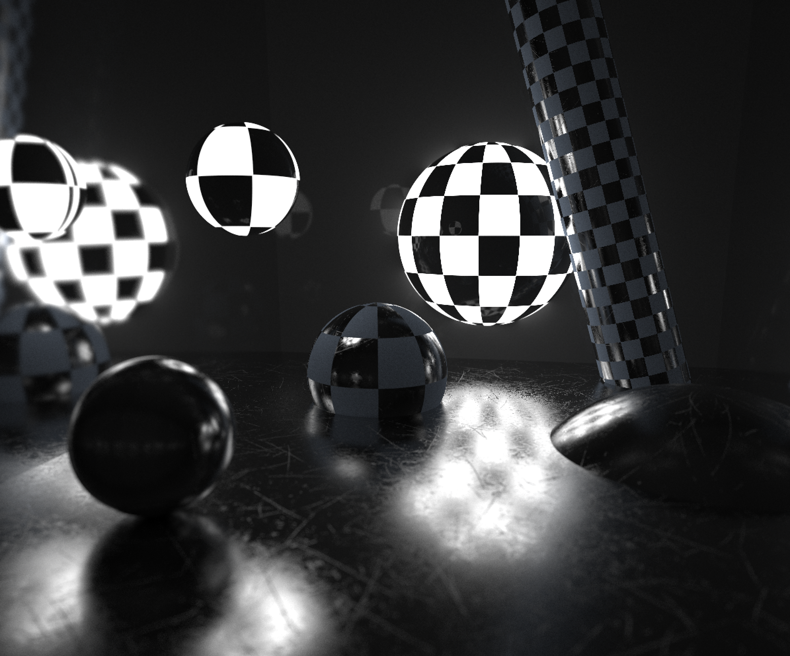

# MiniRT
Small cpu ray tracer originally made for a school project at 42 Quebec

originally started with [Francoma](https://github.com/francoismartineau) and later overengineered by yours truly purely for fun while waiting for his return

The project is stained by a lot of unhinged restrictions and formatting requirements that I tried to clean up for this repo so the final project isn't exactly what was used during the cursus but it still certainly might contain some _interesting_ snippets here and there that were useful for working around the rules

Here's some shots for all the eyeballs out there:

