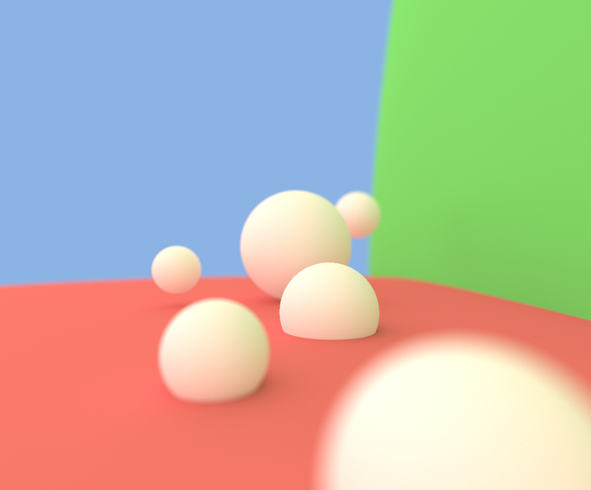

# MiniRT
Small cpu ray tracer originally made for a school project at 42 Quebec

originally started with [Francoma](https://github.com/francoismartineau) and later overengineered by yours truly purely for fun while waiting for his return

The project is stained by a lot of unhinged restrictions and formatting requirements that I tried to clean up for this repo so the final project isn't exactly what was used during the cursus but it still certainly might contain some _interesting_ snippets here and there that were useful for working around the rules

# setting it up
requires opengl and glfw on linux or macos\
simply run make in the root directory of the project\
if you are running on macos you'll need to change the makefile to properly link to glfw since the school computers this was made on had glfw installed with brew in the home directory

Here's some shots for all the eyeballs out there:

